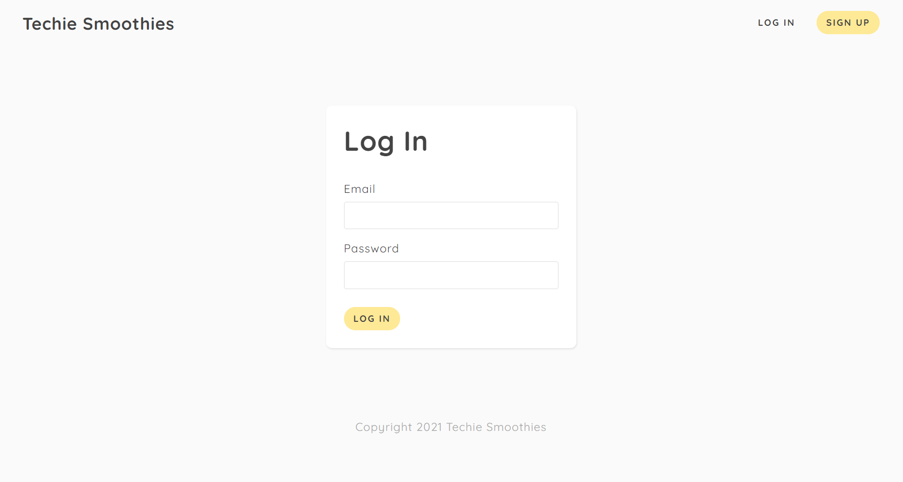
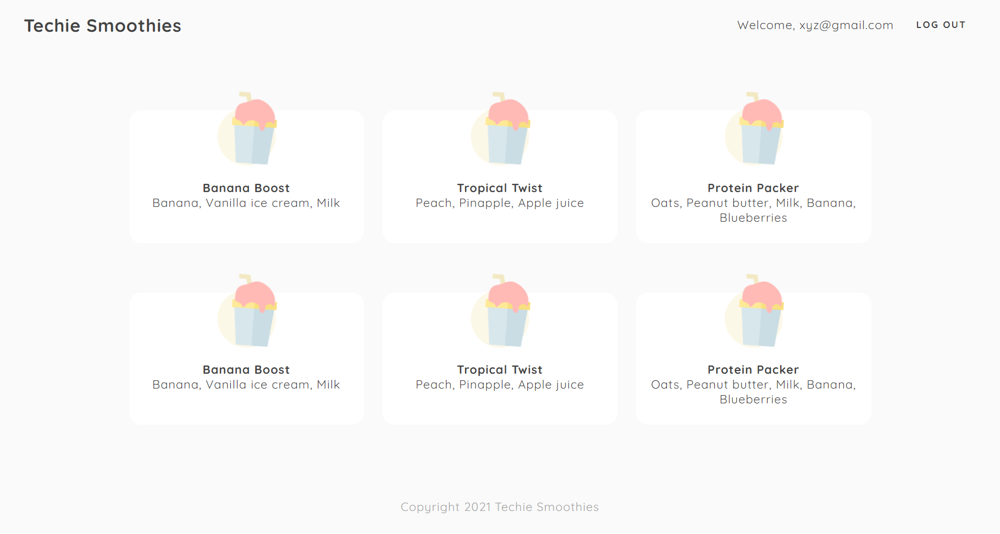

# Techie Smoothies

> This website has been built using **NodeJS** and **MongoDB**. It demonstrates some of the best practices used in modern **JWT** authenticated websites.

### Concepts Covered
- [x] `MVC` Architecture
- [x] Password Hashing
- [x] Mongoose Hooks
- [x] Cookies (Client & Server side)
- [x] JSON Web Tokens (`JWT`)
- [x] Conditional Rendering

### Landing Page

### Sign Up Page

### Login Page

### Smoothie Listing (Main Page)

